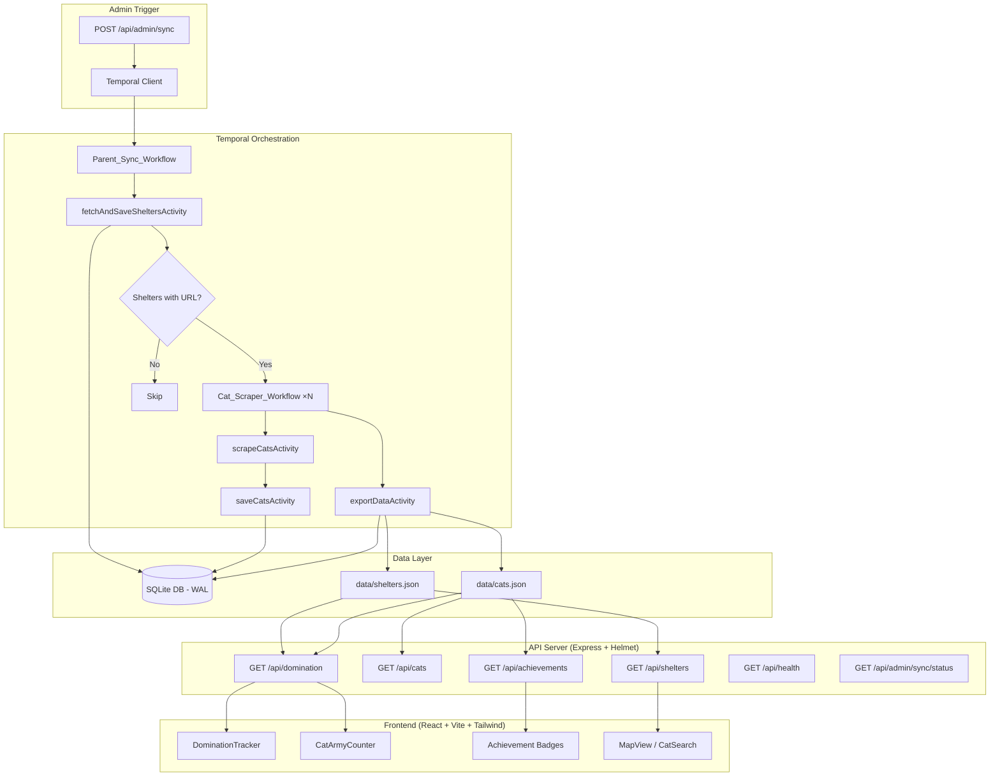

# Design Document: Hackathon Polish

## Overview

This design covers the final "polish" pass for the Mrucznik 🐱 project for the "World Cat Domination Day" hackathon. It integrates six major areas: Temporal workflow hardening with parent/child orchestration, SQLite→JSON export pipeline, gamification endpoints (/api/domination, /api/achievements), frontend theme components (DominationTracker, CatArmyCounter, achievements badges, skeleton screens), security hardening (CSP, HSTS, graceful shutdown), and production build optimization.

The existing codebase already has a Temporal worker/client, Express server reading from JSON files, and a React/Vite frontend. This design extends those foundations without replacing them.

## Architecture



### Data Flow Summary

1. Admin triggers sync via POST `/api/admin/sync`
2. Temporal Client starts `parentSyncWorkflow` (non-blocking, returns workflow ID)
3. Parent workflow fetches shelters from external API → upserts to SQLite
4. For each shelter with a website URL, a child `catScraperWorkflow` is spawned
5. Child workflows scrape + save cats to SQLite (retries with exponential backoff)
6. After all children complete, `exportDataActivity` atomically writes JSON to `data/`
7. API server reads from JSON files on each request (no restart needed)
8. Frontend fetches `/api/domination` and `/api/achievements` for gamification UI

## Components and Interfaces

### Backend Components

#### 1. Sync Trigger Endpoint (`POST /api/admin/sync`)

```typescript
// src/server.ts — new route
interface SyncResponse {
  workflow_id: string;
  message: string;
}
// Returns immediately after starting workflow. Auth: Bearer token.
```

#### 2. Sync Status Endpoint (`GET /api/admin/sync/status`)

```typescript
interface SyncStatusResponse {
  status: "running" | "completed" | "failed" | "never_run";
  start_time: string | null;     // ISO 8601
  completion_time: string | null; // ISO 8601
}
// Queries Temporal for most recent shelter-sync-* workflow.
```

#### 3. Domination Endpoint (`GET /api/domination`)

```typescript
interface DominationResponse {
  total_shelters_in_poland: 190;
  shelters_covered: number;
  percentage: number;          // 0.00–100.00, 2 decimal places
  cats_in_army: number;
  domination_level: string;    // One of 4 level names
}
```

**Level Mapping:**
| Percentage Range | Level |
|---|---|
| 0–24.99 | "Kocie Zwiadowcy" |
| 25.00–49.99 | "Kocia Partyzantka" |
| 50.00–74.99 | "Kocia Ofensywa" |
| 75.00–100.00 | "Pełna Kocia Dominacja" |

#### 4. Achievements Endpoint (`GET /api/achievements`)

```typescript
interface Achievement {
  name: string;
  description: string;
  icon: string;           // emoji
  unlocked_at: string;    // ISO 8601
}
// Returns Achievement[] — empty array if no thresholds met
```

**Achievement Thresholds:**
| Condition | Name | Icon |
|---|---|---|
| cats ≥ 100 | "Pierwsza Setka" | 🎯 |
| shelters_with_cats ≥ 10 | "10 Schronisk" | 🏠 |
| distinct voivodeships = 16 | "Pełna Dominacja" | 🇵🇱 |

#### 5. Health Endpoint (`GET /api/health`)

```typescript
interface HealthResponse {
  status: "ok" | "degraded";
  uptime: number;          // seconds
  timestamp: string;       // ISO 8601
  details?: string;        // only when degraded
}
```

#### 6. Export Activity (`exportDataActivity`)

New activity registered with the Temporal worker. Queries SQLite, writes atomically to `data/shelters.json` and `data/cats.json` using write-to-temp + rename pattern.

```typescript
// src/activities.ts — new export
export async function exportDataActivity(): Promise<{ shelters: number; cats: number }>;
```

#### 7. Graceful Shutdown Handler

```typescript
// src/server.ts — process signal handling
// SIGTERM/SIGINT → stop accepting connections → drain within 10s → exit(0)
// Second signal → force exit(1)
```

### Frontend Components

#### 8. DominationTracker

Location: `frontend/src/components/DominationTracker.tsx`

```typescript
interface DominationTrackerProps {
  data: DominationResponse | null;
  loading: boolean;
}
// Renders: progress bar (filled to percentage), level title, cats_in_army count
```

#### 9. CatArmyCounter

Location: `frontend/src/components/CatArmyCounter.tsx`

```typescript
interface CatArmyCounterProps {
  targetCount: number;
  lang: "pl" | "en";
}
// Animates from 0 to targetCount over 2s with ease-out.
// Displays: 🐱 {formatted_count} Kocia Armia / Cat Army
```

Uses `requestAnimationFrame` for smooth 60fps animation with easeOutCubic function:
```
t => 1 - Math.pow(1 - t, 3)
```

#### 10. AchievementBadges

Location: `frontend/src/components/AchievementBadges.tsx`

```typescript
interface AchievementBadgesProps {
  achievements: Achievement[];
}
// Renders badges in "Odznaki Dominacji" section. Hidden when empty.
```

#### 11. Skeleton Components

- `CatCardSkeleton` — matches CatCard dimensions (208px image + text lines)
- `StatsSkeleton` — matches stats card layout (rounded-2xl)
- `CatOfDaySkeleton` — 320px height image placeholder

All skeletons use Tailwind `animate-pulse` with `bg-gray-200` placeholder blocks.

### Vite Build Configuration

```typescript
// frontend/vite.config.ts additions
build: {
  rollupOptions: {
    output: {
      manualChunks: {
        vendor: ['react', 'react-dom'],
        leaflet: ['leaflet', 'react-leaflet'],
      },
    },
  },
},
```

Plus `vite-plugin-compression` for gzip generation.

### Security Hardening

Helmet configuration update:

```typescript
helmet({
  contentSecurityPolicy: {
    directives: {
      defaultSrc: ["'self'"],
      scriptSrc: ["'self'", "'unsafe-inline'"],
      styleSrc: ["'self'", "'unsafe-inline'", "https://fonts.googleapis.com", "https://unpkg.com"],
      fontSrc: ["'self'", "https://fonts.gstatic.com"],
      imgSrc: ["'self'", "data:", "https:", "http:"],
      connectSrc: ["'self'", ...getTemporalConnectSrc()],
      frameSrc: ["'none'"],
    },
  },
  hsts: { maxAge: 31536000, includeSubDomains: true },
  xContentTypeOptions: true,  // nosniff
  hidePoweredBy: true,
})
```

`getTemporalConnectSrc()` validates `TEMPORAL_ADDRESS` as `host:port` format before including it.

### Cache Headers Middleware

```typescript
// For hashed static files (contain 8+ char hex in filename)
app.use('/assets', (req, res, next) => {
  if (/\.[a-f0-9]{8,}\.(js|css)/.test(req.path)) {
    res.setHeader('Cache-Control', 'max-age=31536000, immutable');
  }
  next();
});

// index.html always no-cache
```

## Data Models

### SQLite Schema (existing, unchanged)

```sql
CREATE TABLE shelters (
  id_zewnetrzne INTEGER PRIMARY KEY,
  name TEXT NOT NULL,
  website_url TEXT,
  city TEXT NOT NULL,
  voivodeship TEXT NOT NULL,
  updated_at TEXT DEFAULT (datetime('now'))
);

CREATE TABLE cats (
  id INTEGER PRIMARY KEY AUTOINCREMENT,
  shelter_id INTEGER NOT NULL REFERENCES shelters(id_zewnetrzne),
  name TEXT NOT NULL,
  description TEXT DEFAULT '',
  image_url TEXT,
  scraped_at TEXT DEFAULT (datetime('now'))
);
```

### Export JSON Schema

**shelters.json:**
```json
[{
  "id_zewnetrzne": 12345,
  "name": "Schronisko Katowice",
  "city": "Katowice",
  "voivodeship": "śląskie",
  "website_url": "https://example.com",
  "cat_count": 42
}]
```

**cats.json:**
```json
[{
  "id": 1,
  "name": "Mruczek",
  "description": "Friendly ginger cat",
  "image_url": "https://example.com/cat.jpg",
  "source_url": "https://shelter.com/cats/1",
  "shelter_id": 12345,
  "shelter_name": "Schronisko Katowice",
  "shelter_city": "Katowice",
  "sex": "samiec",
  "age": "dorosły"
}]
```

### Domination Computation (Pure Function)

```typescript
function computeDomination(shelters: ShelterRecord[], cats: CatRecord[]): DominationResponse {
  const TOTAL = 190;
  const shelterIdsWithCats = new Set(cats.map(c => c.shelter_id));
  const covered = shelters.filter(s => shelterIdsWithCats.has(s.id_zewnetrzne)).length;
  const percentage = Math.round((covered / TOTAL) * 10000) / 100; // 2 decimal
  const level = percentage >= 75 ? "Pełna Kocia Dominacja"
    : percentage >= 50 ? "Kocia Ofensywa"
    : percentage >= 25 ? "Kocia Partyzantka"
    : "Kocie Zwiadowcy";
  return { total_shelters_in_poland: TOTAL, shelters_covered: covered, percentage, cats_in_army: cats.length, domination_level: level };
}
```

### Achievement Computation (Pure Function)

```typescript
function computeAchievements(cats: CatRecord[], shelters: ShelterRecord[]): Achievement[] {
  const achievements: Achievement[] = [];
  const now = new Date().toISOString();
  const shelterIdsWithCats = new Set(cats.map(c => c.shelter_id));
  const distinctVoivodeships = new Set(shelters.filter(s => shelterIdsWithCats.has(s.id_zewnetrzne)).map(s => s.voivodeship));

  if (cats.length >= 100) achievements.push({ name: "Pierwsza Setka", description: "100 kotów w bazie!", icon: "🎯", unlocked_at: now });
  if (shelterIdsWithCats.size >= 10) achievements.push({ name: "10 Schronisk", description: "10 schronisk z kotami!", icon: "🏠", unlocked_at: now });
  if (distinctVoivodeships.size === 16) achievements.push({ name: "Pełna Dominacja", description: "Koty ze wszystkich województw!", icon: "🇵🇱", unlocked_at: now });

  return achievements;
}
```

### Atomic Write Pattern

```typescript
import { writeFileSync, renameSync, existsSync } from "fs";
import { tmpdir } from "os";
import { join } from "path";

function atomicWriteJSON(targetPath: string, data: unknown): void {
  const tmpPath = join(tmpdir(), `export-${Date.now()}-${Math.random().toString(36).slice(2)}.json`);
  writeFileSync(tmpPath, JSON.stringify(data, null, 2));
  renameSync(tmpPath, targetPath); // atomic on same filesystem
}
```

For cross-filesystem safety, both temp files are written first, then both renames happen. If any rename fails, the original files remain intact.

## Correctness Properties

*A property is a characteristic or behavior that should hold true across all valid executions of a system — essentially, a formal statement about what the system should do. Properties serve as the bridge between human-readable specifications and machine-verifiable correctness guarantees.*

### Property 1: Child workflow filtering

*For any* list of shelters returned by `fetchAndSaveSheltersActivity` (where each shelter may or may not have a non-null `website_url`), the number of child `catScraperWorkflow` executions launched by `parentSyncWorkflow` SHALL equal exactly the count of shelters whose `website_url` is not null and not empty.

**Validates: Requirements 1.4**

### Property 2: Export data correctness and schema

*For any* valid SQLite database state containing shelters and cats (with foreign key relationships), the `exportDataActivity` SHALL produce a `shelters.json` array where each object contains exactly the fields `id_zewnetrzne`, `name`, `city`, `voivodeship`, `website_url`, `cat_count`, and the `cat_count` for each shelter equals the number of cats in the cats table with matching `shelter_id`; and a `cats.json` array where each object contains the fields `id`, `name`, `description`, `image_url`, `source_url`, `shelter_id`, `shelter_name`, `shelter_city`, `sex`, `age` with `shelter_name` and `shelter_city` matching the joined shelter record.

**Validates: Requirements 2.1, 2.2**

### Property 3: Atomic write safety

*For any* export operation where a filesystem write error occurs during the write phase, the previously existing `data/shelters.json` and `data/cats.json` files SHALL remain unchanged (byte-identical to their pre-export state).

**Validates: Requirements 2.4**

### Property 4: Workflow status mapping

*For any* Temporal workflow execution state (RUNNING, COMPLETED, FAILED, TERMINATED, CANCELLED, TIMED_OUT), the `/api/admin/sync/status` endpoint SHALL map it to one of the defined status strings ("running", "completed", "failed") with `start_time` always populated as a valid ISO 8601 string and `completion_time` populated only when status is "completed" or "failed".

**Validates: Requirements 3.2**

### Property 5: Domination computation

*For any* non-negative integer `totalCats` and any set of shelter records (each with a unique `id_zewnetrzne` and `voivodeship`), and any set of cat records (each with a `shelter_id` referencing a shelter), the `computeDomination` function SHALL return: `shelters_covered` equal to the number of distinct shelter IDs that appear in the cats set, `percentage` equal to `round(shelters_covered / 190 * 100, 2)`, `cats_in_army` equal to the total number of cats, and `domination_level` matching the correct range bracket for the computed percentage.

**Validates: Requirements 4.1, 4.2, 4.3, 4.4, 4.5**

### Property 6: Counter display formatting

*For any* non-negative integer and language setting (PL or EN), the `CatArmyCounter` formatted output SHALL contain the cat emoji (🐱), a locale-appropriate thousands-separated representation of the integer, and the label "Kocia Armia" when language is PL or "Cat Army" when language is EN.

**Validates: Requirements 5.2**

### Property 7: Achievement computation

*For any* combination of total cat count, set of shelter IDs that have at least one cat, and set of distinct voivodeships represented by those shelters, the `computeAchievements` function SHALL return an array containing "Pierwsza Setka" if and only if cat count ≥ 100, "10 Schronisk" if and only if shelter count ≥ 10, and "Pełna Dominacja" if and only if voivodeship count = 16. The array SHALL be empty when no thresholds are met.

**Validates: Requirements 6.2, 6.3, 6.4, 6.5, 6.6**

### Property 8: Admin auth rejection without information leakage

*For any* admin endpoint path (`/api/admin/*`) and any request that does not contain a valid Bearer token, the API server SHALL respond with HTTP 401 and a JSON body that does not contain any of: stack traces, file system paths, or server configuration values.

**Validates: Requirements 9.5**

### Property 9: Cache-Control headers for hashed assets

*For any* static file request where the filename matches the pattern `name.HASH.ext` (where HASH is 8+ hexadecimal characters), the response SHALL include a `Cache-Control` header with value `max-age=31536000, immutable`.

**Validates: Requirements 15.4**

## Error Handling

### API Error Responses

| Scenario | HTTP Code | Response |
|---|---|---|
| Temporal unreachable (sync trigger) | 503 | `{ message: "Workflow engine unavailable" }` |
| Temporal unreachable (status check) | 503 | `{ message: "Sync status temporarily unavailable" }` |
| Invalid/missing auth token | 401 | `{ message: "Unauthorized" }` |
| Rate limited (login) | 429 | `{ message: "Too many attempts" }` |
| Data dir inaccessible (health) | 503 | `{ status: "degraded", details: "..." }` |
| Missing data files (domination) | 200 | Zeroed domination response |
| General server error | 503 | `{ message: "Service temporarily unavailable" }` |

### Temporal Activity Retries

| Activity | Max Attempts | Backoff | Timeout |
|---|---|---|---|
| fetchAndSaveSheltersActivity | 3 | Exponential (1s base) | 60s |
| scrapeCatsActivity | 3 | Exponential (1s base) | 60s |
| saveCatsActivity | 3 | Exponential (1s base) | 30s |
| exportDataActivity | 3 | Exponential (1s base) | 30s |

### Graceful Shutdown Sequence

1. Receive SIGTERM/SIGINT → log "Graceful shutdown initiated"
2. Stop accepting new connections (`server.close()`)
3. Wait up to 10s for in-flight requests to complete
4. If timeout: force-close remaining connections, exit(0)
5. If second signal during shutdown: immediate exit(1)

### Frontend Error Handling

- API fetch failures → show inline error with retry button
- `/api/domination` failure → CatArmyCounter shows "0", DominationTracker hidden
- `/api/achievements` failure → hide achievements section silently
- Network timeout (15s) → treated same as HTTP error

## Testing Strategy

### Property-Based Tests (fast-check)

Property-based testing is appropriate for this feature because there are multiple pure computation functions (domination calculation, achievement logic, export transformation, counter formatting) where universal properties hold across wide input ranges.

**Library:** fast-check (already in both backend and frontend devDependencies)
**Configuration:** Minimum 100 iterations per property test
**Tag format:** `Feature: hackathon-polish, Property {N}: {title}`

Properties to implement:
1. **Property 1** (backend): Generate random shelter lists, verify child workflow count equals shelters with URLs
2. **Property 2** (backend): Generate random DB state, run export query, verify output schema and join correctness
3. **Property 3** (backend): Simulate write failures, verify original files unchanged
4. **Property 5** (backend): Generate random shelter/cat sets, verify domination computation
5. **Property 7** (backend): Generate random data combinations, verify achievement thresholds
6. **Property 6** (frontend): Generate random integers and lang, verify formatted output
7. **Property 8** (backend): Generate random admin paths and invalid tokens, verify 401 without leaks
8. **Property 9** (backend): Generate filenames with/without hashes, verify cache headers

### Unit Tests (Vitest)

- Health endpoint response shape
- Graceful shutdown signal handling (with process spawn)
- Skeleton component rendering
- DominationTracker rendering with mock data
- Achievement badges visibility toggle
- CSP header validation
- HSTS header validation

### Integration Tests (Vitest + supertest)

- POST `/api/admin/sync` with mock Temporal client
- GET `/api/admin/sync/status` with mock Temporal query
- GET `/api/domination` with real data files
- GET `/api/achievements` with real data files
- GET `/api/health` under normal and degraded conditions
- Auth middleware across all admin endpoints

### Build Verification Tests

- Verify vendor chunk exists and is < 500kB
- Verify content hashes in output filenames
- Verify .gz files generated for assets > 1kB

### Documentation Verification

- README contains all required sections (architecture, setup, deployment, security, tech stack, contributing, project description)
- SECURITY.md contains all required sections
- Mermaid diagrams parse without errors
