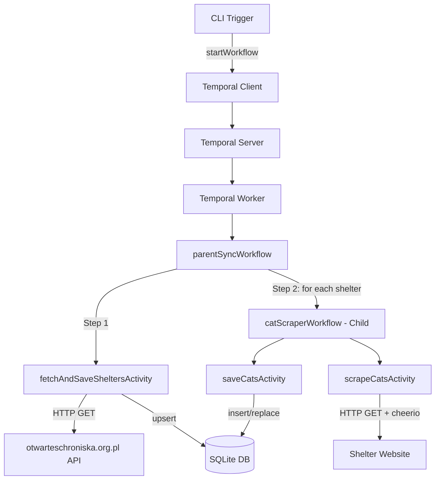
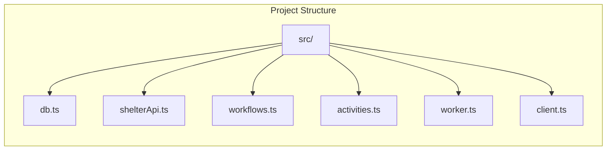
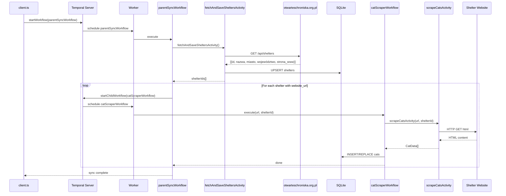

# Design Document: Shelter Sync with Cat Scraper

## Overview

This system is a PoC backend that synchronizes animal shelter data from the otwarteschroniska.org.pl API into a local SQLite database, then orchestrates reliable web scraping of cat listings from each shelter's website using Temporal.io workflows. The architecture separates concerns into three layers: external API integration (shelter fetching), workflow orchestration (Temporal), and data persistence (SQLite). The scraper is intentionally simplified for the PoC — it extracts basic cat data (name, description, image URL) from shelter websites using cheerio HTML parsing.

## Architecture





## Sequence Diagram



## Components and Interfaces

### Component 1: Database Layer (db.ts)

**Purpose**: Manages SQLite connection, schema creation, and all data access operations.

```typescript
import Database from "better-sqlite3";

interface Shelter {
  id_zewnetrzne: number;
  name: string;
  website_url: string | null;
  city: string;
  voivodeship: string;
}

interface Cat {
  id?: number;
  shelter_id: number;
  name: string;
  description: string;
  image_url: string | null;
}

function initializeDatabase(dbPath?: string): Database.Database;
function upsertShelters(db: Database.Database, shelters: Shelter[]): void;
function saveCats(db: Database.Database, shelterId: number, cats: Cat[]): void;
function getSheltersWithWebsite(db: Database.Database): Shelter[];
```

**Responsibilities**:
- Create and manage SQLite database connection
- Initialize schema (shelters and cats tables)
- Upsert shelter records (insert or update on conflict by id_zewnetrzne)
- Save cat records for a shelter (replace existing cats for that shelter)
- Query shelters that have a website_url

### Component 2: Shelter API Client (shelterApi.ts)

**Purpose**: Fetches shelter data from the otwarteschroniska.org.pl external API.

```typescript
interface ApiShelter {
  id: number;
  nazwa: string;
  miasto: string;
  województwo: string;
  strona_www: string | null;
}

function fetchSheltersFromApi(): Promise<ApiShelter[]>;
```

**Responsibilities**:
- HTTP GET request to otwarteschroniska.org.pl API endpoint
- Parse JSON response into typed shelter objects
- Handle HTTP errors with retries (Temporal will handle broader retry logic)

### Component 3: Temporal Activities (activities.ts)

**Purpose**: Contains all activity implementations — the units of work that perform side effects.

```typescript
function fetchAndSaveSheltersActivity(): Promise<number[]>;
function scrapeCatsActivity(url: string, shelterId: number): Promise<Cat[]>;
function saveCatsActivity(shelterId: number, cats: Cat[]): Promise<void>;
```

**Responsibilities**:
- `fetchAndSaveSheltersActivity`: Orchestrates fetching from API + upserting to DB, returns shelter IDs with websites
- `scrapeCatsActivity`: Fetches HTML from shelter website, parses with cheerio, extracts cat data
- `saveCatsActivity`: Persists scraped cat data to SQLite

### Component 4: Temporal Workflows (workflows.ts)

**Purpose**: Defines the workflow orchestration logic — deterministic, no side effects.

```typescript
function parentSyncWorkflow(): Promise<void>;
function catScraperWorkflow(url: string, shelterId: number): Promise<void>;
```

**Responsibilities**:
- `parentSyncWorkflow`: Top-level orchestrator that calls fetchAndSaveShelters, then fans out child workflows
- `catScraperWorkflow`: Per-shelter workflow that scrapes and saves cat data

### Component 5: Worker (worker.ts)

**Purpose**: Bootstraps the Temporal worker that listens for and executes workflows/activities.

```typescript
async function runWorker(): Promise<void>;
```

**Responsibilities**:
- Connect to Temporal server
- Register workflows and activities
- Start listening on task queue

### Component 6: Client (client.ts)

**Purpose**: CLI entry point that triggers the parent sync workflow.

```typescript
async function main(): Promise<void>;
```

**Responsibilities**:
- Connect to Temporal server
- Start parentSyncWorkflow execution
- Log workflow result

## Data Models

### SQLite Schema

```sql
CREATE TABLE IF NOT EXISTS shelters (
  id_zewnetrzne INTEGER PRIMARY KEY,
  name TEXT NOT NULL,
  website_url TEXT,
  city TEXT NOT NULL,
  voivodeship TEXT NOT NULL,
  updated_at TEXT DEFAULT (datetime('now'))
);

CREATE TABLE IF NOT EXISTS cats (
  id INTEGER PRIMARY KEY AUTOINCREMENT,
  shelter_id INTEGER NOT NULL,
  name TEXT NOT NULL,
  description TEXT DEFAULT '',
  image_url TEXT,
  scraped_at TEXT DEFAULT (datetime('now')),
  FOREIGN KEY (shelter_id) REFERENCES shelters(id_zewnetrzne)
);

CREATE INDEX IF NOT EXISTS idx_cats_shelter ON cats(shelter_id);
```

**Validation Rules**:
- `shelters.id_zewnetrzne` must match the external API's id field
- `shelters.name` cannot be empty
- `cats.shelter_id` must reference an existing shelter
- `cats.name` cannot be empty

### API Response Shape (otwarteschroniska.org.pl)

```typescript
// Expected response from GET /api/shelters (or equivalent endpoint)
type ApiResponse = ApiShelter[];

interface ApiShelter {
  id: number;
  nazwa: string;          // shelter name
  miasto: string;         // city
  województwo: string;    // voivodeship/province
  strona_www: string | null; // website URL (may be null)
}
```

## Key Functions with Formal Specifications

### Function: fetchSheltersFromApi()

```typescript
async function fetchSheltersFromApi(): Promise<ApiShelter[]>
```

**Preconditions:**
- Network connectivity to otwarteschroniska.org.pl
- API endpoint is available and returns JSON

**Postconditions:**
- Returns array of ApiShelter objects
- Each shelter has a numeric `id` and non-empty `nazwa`
- If API returns error, throws with descriptive message

### Function: upsertShelters()

```typescript
function upsertShelters(db: Database.Database, shelters: Shelter[]): void
```

**Preconditions:**
- `db` is an initialized database with shelters table
- `shelters` is an array of valid Shelter objects

**Postconditions:**
- All shelters in input exist in database after call
- Existing shelters (by id_zewnetrzne) are updated with new data
- New shelters are inserted
- `updated_at` timestamp is refreshed for upserted rows
- Total shelter count in DB >= input length

### Function: saveCats()

```typescript
function saveCats(db: Database.Database, shelterId: number, cats: Cat[]): void
```

**Preconditions:**
- `db` is an initialized database with cats table
- `shelterId` references an existing shelter in the database
- `cats` is an array of Cat objects with non-empty names

**Postconditions:**
- Previous cats for this shelter_id are removed
- All cats in input are now stored with the given shelter_id
- Cat count for shelter equals input array length

### Function: scrapeCatsActivity()

```typescript
async function scrapeCatsActivity(url: string, shelterId: number): Promise<Cat[]>
```

**Preconditions:**
- `url` is a valid HTTP/HTTPS URL
- `shelterId` is a positive integer

**Postconditions:**
- Returns array of Cat objects extracted from the HTML page
- Each cat has a non-empty name
- If page is unreachable or unparseable, returns empty array (graceful degradation)

## Example Usage

```typescript
// === Starting the full sync (client.ts) ===
import { Client, Connection } from "@temporalio/client";

const connection = await Connection.connect({ address: "localhost:7233" });
const client = new Client({ connection });

const handle = await client.workflow.start("parentSyncWorkflow", {
  taskQueue: "shelter-sync",
  workflowId: "shelter-sync-" + Date.now(),
});

console.log(`Started workflow: ${handle.workflowId}`);
const result = await handle.result();
console.log("Sync complete:", result);

// === Worker setup (worker.ts) ===
import { Worker } from "@temporalio/worker";
import * as activities from "./activities";

const worker = await Worker.create({
  workflowsPath: require.resolve("./workflows"),
  activities,
  taskQueue: "shelter-sync",
});

await worker.run();

// === Database usage ===
import { initializeDatabase, upsertShelters, getSheltersWithWebsite } from "./db";

const db = initializeDatabase("./shelter-sync.db");
upsertShelters(db, [
  { id_zewnetrzne: 1, name: "Schronisko Kraków", website_url: "https://example.com", city: "Kraków", voivodeship: "małopolskie" }
]);
const shelters = getSheltersWithWebsite(db);
console.log(shelters); // [{id_zewnetrzne: 1, name: "Schronisko Kraków", ...}]
```

## Error Handling

### Scenario 1: External API Unavailable

**Condition**: otwarteschroniska.org.pl returns non-200 status or network timeout
**Response**: `fetchSheltersFromApi()` throws an error with HTTP status and message
**Recovery**: Temporal automatically retries the activity based on retry policy (exponential backoff, max 3 attempts)

### Scenario 2: Shelter Website Unreachable

**Condition**: A shelter's website returns non-200 or times out during scraping
**Response**: `scrapeCatsActivity()` logs a warning and returns an empty array
**Recovery**: The child workflow completes successfully with zero cats — no cascade failure

### Scenario 3: HTML Parsing Failure

**Condition**: Shelter website HTML doesn't match expected structure
**Response**: cheerio selectors return empty results, activity returns empty cat array
**Recovery**: Graceful degradation — shelter is marked as having 0 cats for this sync

### Scenario 4: Database Write Failure

**Condition**: SQLite write fails (disk full, permission error)
**Response**: Activity throws error, Temporal marks activity as failed
**Recovery**: Temporal retries the activity; if persistent, workflow fails with clear error message

## Testing Strategy

### Unit Testing Approach

- Test `upsertShelters` with various shelter inputs (new, duplicate, updated)
- Test `saveCats` replacement behavior (old cats removed, new cats inserted)
- Test API response parsing (valid JSON, malformed JSON, empty array)
- Test HTML scraping with fixture HTML files

### Property-Based Testing Approach

**Property Test Library**: fast-check

- Upsert idempotence: upserting the same data twice produces identical DB state
- Save cats replacement: saving cats always results in exact count match
- Shelter data integrity: all upserted shelters are retrievable with correct field mapping
- Round-trip consistency: data fetched from DB matches what was inserted

### Integration Testing Approach

- Full workflow execution with mocked external HTTP calls
- Worker processes activities correctly end-to-end
- Verify Temporal child workflow fan-out pattern works

## Correctness Properties

*A property is a characteristic or behavior that should hold true across all valid executions of a system — essentially, a formal statement about what the system should do. Properties serve as the bridge between human-readable specifications and machine-verifiable correctness guarantees.*

### Property 1: Upsert completeness

*For any* array of valid Shelter objects, after calling upsertShelters, every shelter in the input array exists in the database with matching field values (id_zewnetrzne, name, city, voivodeship, website_url), and the total shelter count in the database is greater than or equal to the input array length.

**Validates: Requirements 3.1, 3.2, 3.4**

### Property 2: Upsert idempotence

*For any* array of valid Shelter objects, calling upsertShelters twice with the same data produces an identical database state as calling it once (same row count, same field values for all shelters).

**Validates: Requirements 3.5**

### Property 3: Website filter correctness

*For any* set of shelters stored in the database (some with website_url, some without), getSheltersWithWebsite returns exactly the shelters that have a non-null, non-empty website_url, with all fields correctly mapped.

**Validates: Requirements 4.1, 4.2**

### Property 4: Cat save replacement semantics

*For any* shelter ID and any array of Cat objects, after calling saveCats, the database contains exactly the cats from the input array for that shelter (previous cats are removed, count equals input length, and all input cats are retrievable).

**Validates: Requirements 6.1, 6.2, 6.3, 6.4**

### Property 5: Scraper output validity

*For any* HTML page containing cat elements matching the expected selectors, scrapeCatsActivity returns Cat objects where every cat has a non-empty name, and the extracted data corresponds to the elements present in the HTML.

**Validates: Requirements 5.2, 5.3**

### Property 6: API response parsing correctness

*For any* valid JSON response from the shelter API, fetchSheltersFromApi correctly maps all fields (id→id, nazwa→name, miasto→city, województwo→voivodeship, strona_www→website_url) and returns typed ApiShelter objects.

**Validates: Requirements 2.2, 12.2**

## Dependencies

- **@temporalio/client** — Temporal client for starting workflows
- **@temporalio/worker** — Temporal worker for executing workflows/activities
- **@temporalio/workflow** — Workflow API (deterministic sandbox)
- **@temporalio/activity** — Activity context and utilities
- **better-sqlite3** — Synchronous SQLite driver for Node.js
- **cheerio** — Server-side HTML parsing (jQuery-like API)
- **node-fetch** (or built-in fetch in Node 18+) — HTTP client for API calls
- **fast-check** — Property-based testing library
- **vitest** — Test runner
- **typescript** — TypeScript compiler
- **tsx** — TypeScript execution without compilation step
