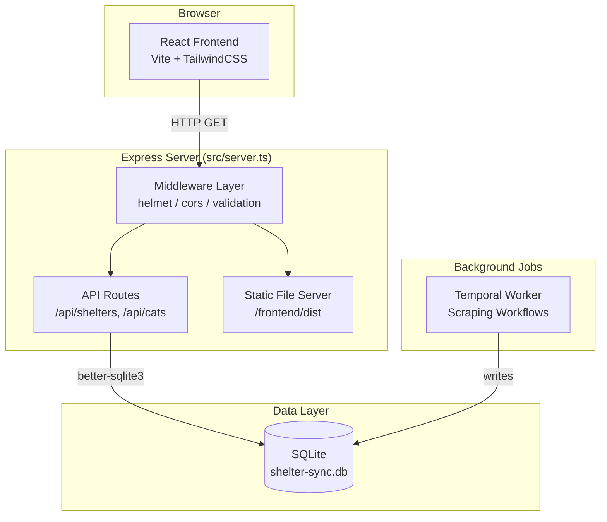

# Design Document: Tactical Cat Frontend

## Overview

This feature adds a REST API layer and a React frontend to the existing Shelter Sync Cat Scraper backend. The API server (`src/server.ts`) exposes the SQLite data via Express.js endpoints, secured with helmet, CORS, and input validation. The frontend (`/frontend`) is a Vite + React + TypeScript SPA styled with TailwindCSS, featuring an interactive map (react-leaflet) and search UI themed as "Operation Purrfect Storm" — a tactical command center for cat adoption.

The architecture is deliberately simple: a single Express server handles both API routes and static file serving for the production build. In development, Vite's dev server proxies API calls to the Express backend.

## Architecture



**Key design decisions:**

1. **Single server for API + static**: Simplifies deployment — one process serves everything. The SPA fallback routes all non-API, non-file paths to `index.html`.
2. **Read-only API**: The frontend only reads data. All writes happen through Temporal workflows. No POST/PUT/DELETE endpoints needed.
3. **Shared database module**: The Express server imports `initializeDatabase` from the existing `db.ts`, reusing connection setup and pragma configuration.
4. **Separate frontend directory**: The `/frontend` folder is an independent Vite project with its own `package.json`, `tsconfig.json`, and `tailwind.config.js`. This keeps frontend dependencies isolated from the Temporal worker.

## Components and Interfaces

### API Server (`src/server.ts`)

```typescript
// Express app setup
import express from "express";
import helmet from "helmet";
import cors from "cors";
import { initializeDatabase } from "./db.js";

// Middleware stack (applied in order):
// 1. helmet() — security headers
// 2. cors({ origin, methods: ["GET"], allowedHeaders: [...] })
// 3. express.static("/frontend/dist") — production static files
// 4. API routes
// 5. SPA fallback — serve index.html for non-API routes
```

**Route handlers:**

| Route | Handler | Query Params | Response |
|-------|---------|-------------|----------|
| `GET /api/shelters` | `listShelters` | — | `ShelterResponse[]` |
| `GET /api/cats` | `searchCats` | `search?: string` | `CatResponse[]` |
| `GET /api/shelters/:id/cats` | `shelterCats` | — | `CatResponse[]` |

### Input Validation Module (`src/validation.ts`)

```typescript
export function sanitizeSearchQuery(raw: string): string;
// - Strips characters outside [a-zA-Z0-9 \-ąćęłńóśźżĄĆĘŁŃÓŚŹŻ]
// - Truncates to 100 characters
// - Returns the cleaned string (may be empty)

export function validateShelterId(raw: string): number | null;
// - Parses as integer
// - Returns null if not a positive integer or exceeds 2,147,483,647
```

### Frontend Components

```
/frontend
├── src/
│   ├── App.tsx              — Layout shell, header, routing
│   ├── components/
│   │   ├── MapView.tsx      — react-leaflet map centered on Poland
│   │   ├── ShelterPin.tsx   — Custom map marker with popup
│   │   ├── SearchPanel.tsx  — "Agent Database" search input + results
│   │   ├── AgentCard.tsx    — Cat profile card (tactical styling)
│   │   ├── LoadingOverlay.tsx — Loading indicator component
│   │   └── ErrorMessage.tsx — Error display with retry button
│   ├── hooks/
│   │   ├── useShelters.ts   — Fetch /api/shelters, manage loading/error state
│   │   ├── useSearchCats.ts — Debounced search, fetch /api/cats?search=...
│   │   └── useShelterCats.ts — Fetch /api/shelters/:id/cats
│   ├── types.ts             — Shared TypeScript interfaces
│   ├── api.ts               — API client (fetch wrapper with error handling)
│   └── main.tsx             — Vite entry point
├── index.html
├── package.json
├── tsconfig.json
├── tailwind.config.js
├── postcss.config.js
└── vite.config.ts           — Proxy /api to Express in dev mode
```

### Key Frontend Interfaces

```typescript
// types.ts
export interface ShelterResponse {
  id_zewnetrzne: number;
  name: string;
  city: string;
  voivodeship: string;
  website_url: string | null;
  cat_count: number;
}

export interface CatResponse {
  id: number;
  name: string;
  description: string;
  image_url: string | null;
  shelter_id: number;
  shelter_name: string;
  shelter_city: string;
}

export interface ApiError {
  message: string;
}
```

## Data Models

### Database Schema (existing, read-only from API perspective)

```sql
-- shelters table
CREATE TABLE shelters (
  id_zewnetrzne INTEGER PRIMARY KEY,
  name TEXT NOT NULL,
  website_url TEXT,
  city TEXT NOT NULL,
  voivodeship TEXT NOT NULL,
  updated_at TEXT DEFAULT (datetime('now'))
);

-- cats table
CREATE TABLE cats (
  id INTEGER PRIMARY KEY AUTOINCREMENT,
  shelter_id INTEGER NOT NULL,
  name TEXT NOT NULL,
  description TEXT DEFAULT '',
  image_url TEXT,
  scraped_at TEXT DEFAULT (datetime('now')),
  FOREIGN KEY (shelter_id) REFERENCES shelters(id_zewnetrzne)
);

CREATE INDEX idx_cats_shelter ON cats(shelter_id);
```

### API Response Shapes

**GET /api/shelters:**
```json
[
  {
    "id_zewnetrzne": 12345,
    "name": "Schronisko Kraków",
    "city": "Kraków",
    "voivodeship": "małopolskie",
    "website_url": "https://example.com",
    "cat_count": 15
  }
]
```

**GET /api/cats?search=mruczek:**
```json
[
  {
    "id": 1,
    "name": "Mruczek",
    "description": "Friendly tabby cat",
    "image_url": "https://example.com/mruczek.jpg",
    "shelter_id": 12345,
    "shelter_name": "Schronisko Kraków",
    "shelter_city": "Kraków"
  }
]
```

**Error response (all errors):**
```json
{
  "message": "Shelter not found"
}
```

### SQL Queries

**List shelters with cat count:**
```sql
SELECT s.id_zewnetrzne, s.name, s.city, s.voivodeship, s.website_url,
       COUNT(c.id) AS cat_count
FROM shelters s
LEFT JOIN cats c ON c.shelter_id = s.id_zewnetrzne
GROUP BY s.id_zewnetrzne;
```

**Search cats (with search term):**
```sql
SELECT c.id, c.name, c.description, c.image_url, c.shelter_id,
       s.name AS shelter_name, s.city AS shelter_city
FROM cats c
JOIN shelters s ON s.id_zewnetrzne = c.shelter_id
WHERE c.name LIKE '%' || ? || '%' OR s.city LIKE '%' || ? || '%'
LIMIT 200;
```

**Cats by shelter:**
```sql
SELECT c.id, c.name, c.description, c.image_url, c.shelter_id,
       s.name AS shelter_name, s.city AS shelter_city
FROM cats c
JOIN shelters s ON s.id_zewnetrzne = c.shelter_id
WHERE c.shelter_id = ?;
```


## Correctness Properties

*A property is a characteristic or behavior that should hold true across all valid executions of a system — essentially, a formal statement about what the system should do. Properties serve as the bridge between human-readable specifications and machine-verifiable correctness guarantees.*

### Property 1: Shelter cat_count matches actual cat records

*For any* set of shelters and cats in the database, the `cat_count` field returned by GET /api/shelters for each shelter SHALL equal the number of cat records in the `cats` table with a matching `shelter_id`.

**Validates: Requirements 1.1**

### Property 2: Search returns only matching results

*For any* non-empty sanitized search term and any database state, every cat object in the response from GET /api/cats?search=X SHALL have either its `name` containing X (case-insensitive) OR its associated shelter's `city` containing X (case-insensitive).

**Validates: Requirements 2.1**

### Property 3: Search result count bounded by limit

*For any* database state with N total cats and any search query, the number of results returned by GET /api/cats SHALL not exceed 200.

**Validates: Requirements 2.2**

### Property 4: Sanitized empty input equivalent to no filter

*For any* input string that, after sanitization (stripping disallowed characters), results in an empty string, the API response from GET /api/cats?search=X SHALL be identical to the response from GET /api/cats with no search parameter.

**Validates: Requirements 2.4, 5.5**

### Property 5: Input sanitization output invariant

*For any* input string, `sanitizeSearchQuery(input)` SHALL produce a string that: (a) contains only characters from the set [a-zA-Z0-9 \-ąćęłńóśźżĄĆĘŁŃÓŚŹŻ], AND (b) has length ≤ 100 characters.

**Validates: Requirements 5.1, 5.2**

### Property 6: Shelter ID validation correctness

*For any* string input, `validateShelterId(input)` SHALL return a positive integer ≤ 2,147,483,647 if and only if the input represents a valid positive integer within that range; otherwise it SHALL return null.

**Validates: Requirements 5.3, 3.3**

### Property 7: Response format completeness

*For any* successful API response returning cat objects, every object SHALL contain all fields (id, name, description, image_url, shelter_id, shelter_name, shelter_city) with no field omitted, where nullable fields (image_url) appear as JSON null when they have no value. Similarly, *for any* shelter response object, all fields (id_zewnetrzne, name, city, voivodeship, website_url, cat_count) SHALL be present.

**Validates: Requirements 12.3, 12.4, 12.5**

### Property 8: All success responses have JSON Content-Type

*For any* valid request to any API endpoint that produces a 2xx response, the response SHALL include Content-Type header set to application/json.

**Validates: Requirements 12.1**

### Property 9: All error responses contain message field

*For any* request to any API endpoint that produces a 4xx or 5xx response, the response body SHALL be valid JSON containing a "message" field of type string.

**Validates: Requirements 12.2**

### Property 10: SPA fallback for non-API paths

*For any* URL path that does not start with "/api/" and does not match a static file in /frontend/dist, the server SHALL respond with the contents of /frontend/dist/index.html (when it exists).

**Validates: Requirements 10.3**

### Property 11: Description truncation

*For any* cat description string longer than 150 characters, the displayed text in an AgentCard SHALL be exactly 150 characters followed by an ellipsis ("…"). For descriptions of 150 characters or fewer, the full text SHALL be displayed unchanged.

**Validates: Requirements 8.1**

### Property 12: Shelter cats endpoint returns exactly the shelter's cats

*For any* shelter that exists in the database, GET /api/shelters/:id/cats SHALL return exactly the set of cat records whose shelter_id matches the requested id — no more, no fewer.

**Validates: Requirements 3.1**

## Error Handling

### API Server Error Strategy

| Scenario | HTTP Status | Response | Recovery |
|----------|-------------|----------|----------|
| Database unreachable / query error | 503 | `{ "message": "Service temporarily unavailable" }` | Caller retries |
| Shelter ID not found | 404 | `{ "message": "Shelter not found" }` | Caller uses valid ID |
| Invalid shelter ID format | 400 | `{ "message": "Invalid shelter ID" }` | Caller fixes input |
| Unknown route (not /api/*) | — | SPA fallback (index.html) | N/A |
| Frontend not built (index.html missing) | 404 | `{ "message": "Frontend not built" }` | Run build |

**Implementation approach:**
- Database errors are caught in route handlers via try/catch around `db.prepare().all()` calls.
- A global Express error handler catches any unhandled errors and returns 500 with a generic message.
- Input validation happens before any database access — invalid requests never touch the DB.

### Frontend Error Strategy

| Scenario | UI Behavior | Recovery |
|----------|-------------|----------|
| Shelter fetch fails | Error message overlay on map with "Retry" button | User clicks retry |
| Search request fails | Error message below search input, loading hidden | User retries search |
| Network timeout | Same as fetch failure | Automatic retry possible |
| Image load failure | Browser shows alt text / placeholder remains | Graceful degradation |

**Implementation approach:**
- Custom hooks (`useShelters`, `useSearchCats`) manage `{ data, loading, error }` state.
- Error states render `<ErrorMessage>` component with retry callback.
- The `api.ts` client throws typed errors for non-2xx responses.

## Testing Strategy

### Property-Based Tests (fast-check + vitest)

Property-based tests verify the correctness properties defined above. Each test generates random inputs and verifies invariants hold universally.

**Library:** fast-check (already in devDependencies)
**Runner:** vitest (already configured)
**Minimum iterations:** 100 per property

Tests will be organized in:
- `src/server.property.test.ts` — API-level properties (Properties 1–4, 7–10, 12)
- `src/validation.property.test.ts` — Pure function properties (Properties 5–6)
- `frontend/src/components/AgentCard.test.ts` — UI truncation property (Property 11)

Each property test will include a tag comment:
```typescript
// Feature: tactical-cat-frontend, Property 5: Input sanitization output invariant
```

### Unit Tests (vitest)

Unit tests cover specific examples, edge cases, and error conditions:

- **API routes**: 404 for missing shelter, 400 for invalid ID, 503 for DB error, empty database returns []
- **Input validation**: specific edge cases (empty string, max-length boundary, only-stripped-chars)
- **Frontend components**: placeholder image for null URL, "No intel available" for empty description, header text, loading states

### Integration Tests

- Security headers present (helmet/CORS smoke tests)
- Static file serving with correct Content-Type
- SPA fallback when index.html exists vs. missing
- End-to-end search flow: insert data → query → verify response

### Test Execution

```bash
# Backend tests (from project root)
npm test

# Frontend tests (from /frontend)
cd frontend && npm test
```

All property-based tests use `fc.assert(fc.property(...), { numRuns: 100 })` minimum. Tests requiring a database use in-memory SQLite (`:memory:`) initialized with `initializeDatabase()` from the existing `db.ts` module, keeping tests fast and isolated.
