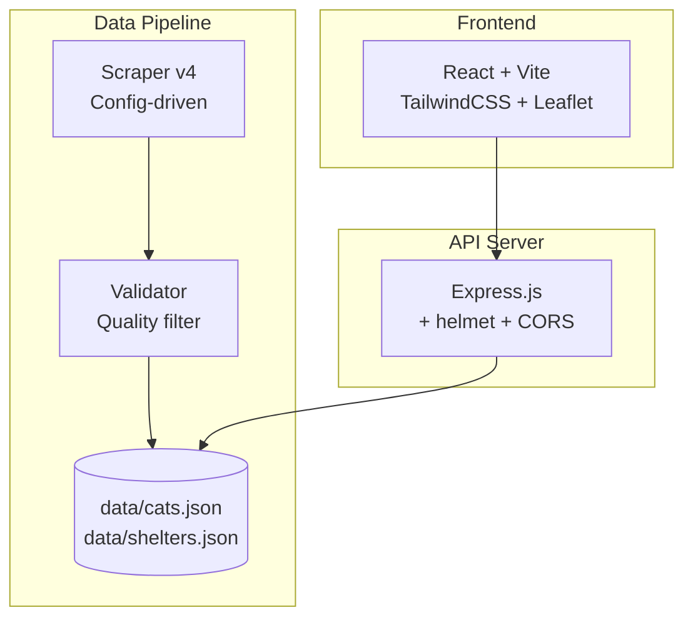

# Mrucznik 🐱

**Cat adoption portal** — aggregates cats available for adoption from shelters across Poland into one searchable, map-enabled platform with adoption guides.

## Features

- 🔍 **Search** — find cats by name, city, or shelter
- 🗺️ **Interactive map** — browse shelters across Poland with cat counts
- 📖 **Adoption guides** — first cat, home prep, costs, FIV/FeLV info, vet checklist
- 🤖 **Smart scraping** — config-driven scrapers for 40+ shelter websites
- ✅ **Auto-validation** — removes junk entries, duplicates, and non-cat results

## Architecture



## Quick Start

```bash
# Install dependencies
npm install
cd frontend && npm install && cd ..

# Scrape fresh data (takes ~15 min)
npm run scrape

# Start API server
npm run server

# Start frontend dev server (in another terminal)
cd frontend && npm run dev
```

The frontend runs at `http://localhost:5173` with API proxy to port 3000.

## Scripts

| Command | Description |
|---------|-------------|
| `npm run scrape` | Full pipeline: scrape all shelters + validate |
| `npm run scrape-only` | Scrape without validation |
| `npm run validate` | Run validation/cleanup on existing data |
| `npm run server` | Start Express API server (port 3000) |
| `npm test` | Run backend tests |
| `cd frontend && npm run dev` | Frontend dev server |
| `cd frontend && npm run build` | Production frontend build |

## Tech Stack

| Component | Technology |
|-----------|-----------|
| Scraping | Node.js + Cheerio (config-driven) |
| API | Express.js + helmet + CORS |
| Data | JSON files (no database needed) |
| Frontend | React 18 + Vite + TailwindCSS |
| Map | Leaflet (react-leaflet) |
| Testing | Vitest + fast-check |
| CI | GitHub Actions |
| Orchestration | Temporal.io (optional, for scheduled scraping) |

## Data Management

Cat and shelter data lives in `data/` as editable JSON files:

- `data/cats.json` — all cats with name, description, image, source URL, metadata
- `data/shelters.json` — shelters with coordinates, URLs, cat counts

Scraper config in `scraper-config.json` — CSS selectors per shelter domain.

### Adding a new shelter

1. Add entry to `data/shelters.json` with `website_url`
2. Add CSS selectors to `scraper-config.json` for the domain
3. Run `npm run scrape`

## Project Structure

```
├── data/                    # JSON data files (cats, shelters)
├── frontend/                # React SPA (Vite + TailwindCSS)
│   └── src/components/      # UI components
├── src/
│   ├── server.ts            # Express API server
│   ├── scraper-v4.ts        # Config-driven scraper
│   ├── validate-data.ts     # Post-scrape validation
│   ├── geocoding.ts         # City → coordinates mapping
│   └── validation.ts        # Input sanitization
├── scraper-config.json      # Per-site CSS selectors
├── .github/workflows/ci.yml # GitHub Actions CI
└── package.json
```

## License

MIT
