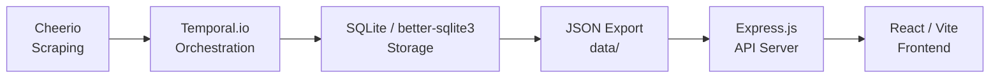

# Mrucznik 🐱

**Cat adoption portal for the "World Cat Domination Day" (Światowy Dzień Kociej Dominacji) hackathon** — aggregates cats available for adoption from shelters across Poland into one searchable, map-enabled platform with gamified domination tracking.

---

## Architecture Overview



### Data Flow

1. **Cheerio** scrapes cat listings from 40+ shelter websites using config-driven CSS selectors
2. **Temporal.io** orchestrates the scraping pipeline — parent workflow spawns child workflows per shelter with retry and exponential backoff
3. **SQLite** (better-sqlite3 in WAL mode) stores shelters and cats with foreign key relationships
4. **JSON Export** activity atomically writes `data/shelters.json` and `data/cats.json` after sync completes
5. **Express.js** serves REST API endpoints reading from the exported JSON files, secured with Helmet and CORS
6. **React/Vite** frontend displays interactive map, cat search, domination tracker, and achievement badges

---

## Setup

### Prerequisites

- Node.js 20+ (LTS recommended)
- Temporal server running locally ([install guide](https://docs.temporal.io/cli#install))
- npm (bundled with Node.js)

### Installation

1. Clone the repository:
   ```bash
   git clone https://github.com/your-org/CatHackathon.git
   cd CatHackathon
   ```

2. Install backend dependencies:
   ```bash
   npm install
   ```

3. Install frontend dependencies:
   ```bash
   cd frontend && npm install && cd ..
   ```

4. Configure environment variables:
   ```bash
   cp .env.example .env
   ```
   Edit `.env` and set the required values (see [Environment Variables](#environment-variables)).

5. Start the Temporal server (separate terminal):
   ```bash
   temporal server start-dev
   ```

6. Verify setup:
   ```bash
   npm run server &
   curl http://localhost:3000/api/health
   ```
   You should receive `{"status":"ok", ...}` confirming the server is running.

---

## Deployment

### Environment Variables

| Variable | Description | Default |
|----------|-------------|---------|
| `PORT` | API server listen port | `3000` |
| `FRONTEND_ORIGIN` | Allowed CORS origin for the frontend | `http://localhost:5173` |
| `ADMIN_PASSWORD` | Password for admin login (sync trigger, status) | *(required)* |
| `TEMPORAL_ADDRESS` | Temporal server host:port | `localhost:7233` |

### Build Commands

```bash
# Build backend (TypeScript → JavaScript)
npm run build

# Build frontend for production
cd frontend && npm run build && cd ..
```

### Running in Production

```bash
# Start Temporal worker (background)
npm run worker &

# Start API server (serves API + static frontend from frontend/dist)
npm run server &
```

The API server serves the built frontend from `frontend/dist/` and the REST API on the configured `PORT`.

---

## Security

For full details, see [SECURITY.md](./SECURITY.md).

Key measures applied:

- **Input sanitization** — all search queries and IDs are validated/sanitized before use (`sanitizeSearchQuery`, `validateShelterId`)
- **HTTP security headers (Helmet)** — CSP, HSTS (1 year + includeSubDomains), X-Content-Type-Options: nosniff, X-Powered-By removed
- **CORS** — restricted to configured `FRONTEND_ORIGIN`; credentials mode enforced
- **Authentication** — Bearer token for admin endpoints; rate-limited login to prevent brute force
- **Graceful shutdown** — SIGTERM/SIGINT drain connections within 10s before exit

---

## Technology Stack

### Scraping & Data Pipeline

| Technology | Purpose |
|------------|---------|
| [Cheerio](https://cheerio.js.org/) | HTML parsing and CSS-selector-based cat data extraction |
| [Temporal.io](https://temporal.io/) | Workflow orchestration with retries and observability |
| [better-sqlite3](https://github.com/WiseLibs/better-sqlite3) | Embedded SQLite database in WAL mode for structured storage |

### API Server

| Technology | Purpose |
|------------|---------|
| [Express.js 5](https://expressjs.com/) | HTTP server and REST API routing |
| [Helmet](https://helmetjs.github.io/) | Security headers (CSP, HSTS, nosniff) |
| [CORS](https://github.com/expressjs/cors) | Cross-origin resource sharing configuration |
| [dotenv](https://github.com/motdotla/dotenv) | Environment variable loading from .env |

### Frontend

| Technology | Purpose |
|------------|---------|
| [React 18](https://react.dev/) | UI component library |
| [Vite](https://vitejs.dev/) | Frontend build tool and dev server |
| [TailwindCSS](https://tailwindcss.com/) | Utility-first CSS framework |
| [Leaflet](https://leafletjs.com/) + react-leaflet | Interactive shelter map |
| [vite-plugin-compression](https://github.com/vbenjs/vite-plugin-compression) | Gzip asset compression for production builds |

### Testing

| Technology | Purpose |
|------------|---------|
| [Vitest](https://vitest.dev/) | Unit and integration test runner |
| [fast-check](https://fast-check.dev/) | Property-based testing for pure logic |
| [supertest](https://github.com/ladjs/supertest) | HTTP endpoint integration testing |

### Infrastructure

| Technology | Purpose |
|------------|---------|
| [GitHub Actions](https://github.com/features/actions) | CI pipeline (lint, test, build) |
| [TypeScript](https://www.typescriptlang.org/) | Static typing across backend and frontend |
| [tsx](https://github.com/privatenumber/tsx) | TypeScript execution without pre-compilation |

---

## Scripts

| Command | Description |
|---------|-------------|
| `npm run server` | Start Express API server |
| `npm run worker` | Start Temporal worker |
| `npm run client` | Trigger sync workflow via Temporal client |
| `npm run scrape` | Full scrape pipeline (all shelters + validate) |
| `npm run build` | Compile backend TypeScript |
| `npm test` | Run backend tests (Vitest) |
| `npm run export-data` | Export SQLite data to JSON manually |
| `cd frontend && npm run dev` | Frontend dev server (port 5173) |
| `cd frontend && npm run build` | Production frontend build |

---

## Contributing

### Code Style

- **TypeScript** for all source files (strict mode enabled)
- **ESLint** + Prettier for formatting consistency
- Use `const` by default; prefer immutable patterns
- Name files in kebab-case; name exports in camelCase/PascalCase

### PR Process

1. Create a feature branch from `main`: `feature/your-feature-name` or `fix/bug-description`
2. Keep PRs focused — one feature or fix per PR
3. Include a description of what changed and why
4. Ensure `npm test` passes and there are no TypeScript errors (`npm run build`)
5. Request review from at least one team member
6. Squash-merge into `main` after approval

---

## License

MIT
