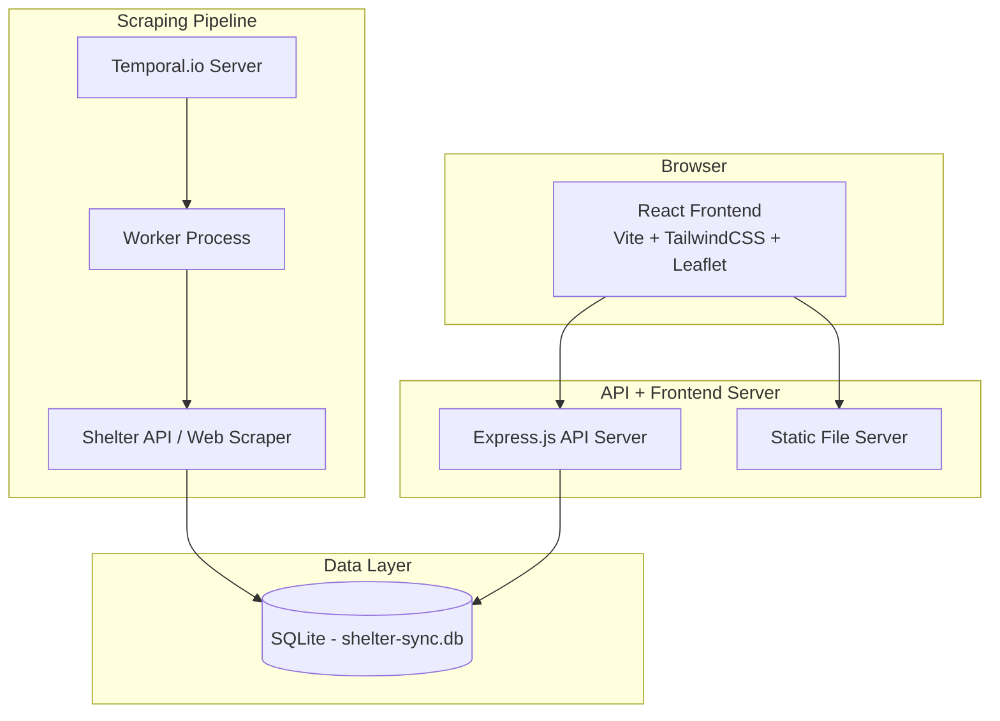

# Operation Purrfect Storm 🐱

## Overview

**Wholesome World Domination** — where cats are secret agents conquering territories through adoption. Each shelter is a tactical base, and each cat is an operative deployed in the field. This project tracks their progress across Poland using real shelter data.

The Tactical Cat Command Center provides a real-time view of feline deployment status: an interactive map showing all bases (shelters) and their stationed agents (cats), plus a searchable database for locating specific operatives.

## Architecture



**Data flow:**
1. Temporal.io orchestrates scraping workflows on a schedule
2. The worker fetches shelter listings and cat data from external sources
3. Data is persisted to a local SQLite database
4. The Express API server reads from SQLite and exposes REST endpoints
5. The React frontend fetches data via `/api/*` endpoints and renders the tactical command center

## Technology Stack

| Component | Technology |
|-----------|-----------|
| Workflow Engine | Temporal.io |
| Backend Runtime | Node.js + TypeScript |
| API Server | Express.js |
| Database | SQLite (better-sqlite3) |
| Security | helmet, CORS |
| Frontend Framework | React 18 |
| Build Tool | Vite |
| Styling | TailwindCSS |
| Map | Leaflet (react-leaflet) |
| Testing | Vitest + fast-check (property-based) |

## Setup Instructions

### Prerequisites

- Node.js 20+
- Temporal server (local or cloud)

### 1. Install dependencies

```bash
npm install
cd frontend && npm install && cd ..
```

### 2. Start Temporal server (local dev)

```bash
temporal server start-dev
```

### 3. Start the worker (scraping)

```bash
npm run worker
```

### 4. Run the client (trigger scraping)

```bash
npm run client
```

### 5. Start the API server

```bash
npm run server
```

### 6. Start frontend dev server

```bash
cd frontend && npm run dev
```

The frontend dev server proxies `/api` calls to `http://localhost:3000`.

### Production build

```bash
cd frontend && npm run build
npm run server
```

The Express server serves the built frontend from `/frontend/dist`.

## Running Tests

```bash
# Backend tests (validation, API, property tests)
npm test

# Frontend tests
cd frontend && npx vitest --run
```

## Aikido Security Scan Report

> Placeholder — security scan report will be inserted here after running Aikido analysis.

---

*"In the name of cuddles and world peace, deploy all agents."* 🐾
