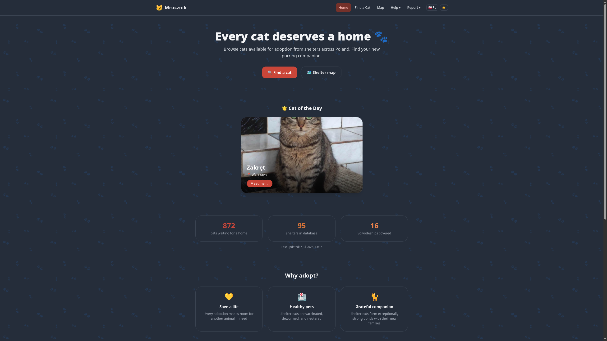
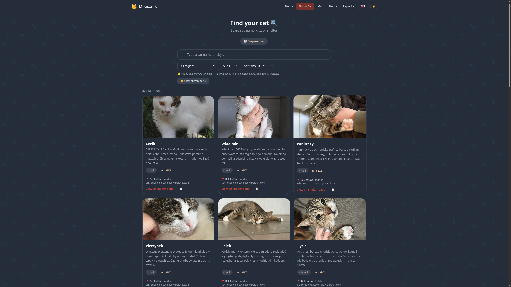
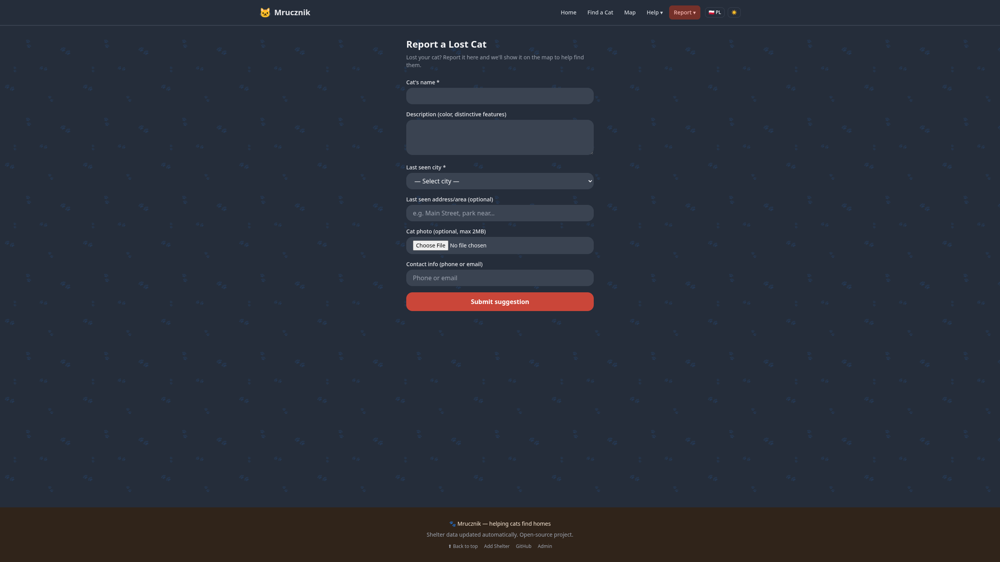
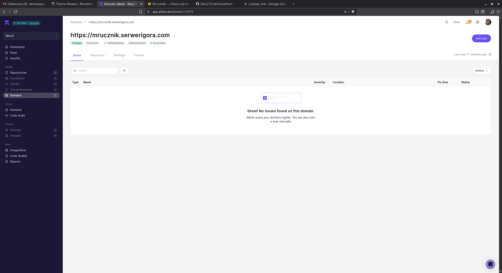
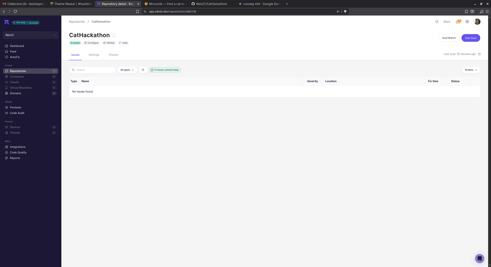

# Screenshots & Demo

## Live Demo

🌐 **Visit the live application:** [mrucznik.serwerigora.com](https://mrucznik.serwerigora.com)

Works on desktop, tablet, and mobile. The application is deployed on a Raspberry Pi and automatically updated on every push to main.

---

## App Screenshots

### Homepage

### Cat Search with Filters

### Interactive Shelter Map

### Lost Cat Report Form

### Mobile View (Responsive)

---

## Security Scan (Aikido)

### Scan Results

---

## Key User Flows

### Flow 1: Finding a Cat to Adopt

1. User opens the site → sees Cat of the Day and stats
2. Clicks "Find a Cat" → search page with filters
3. Types their city → sees local cats
4. Clicks a cat card → sees photo in lightbox
5. Clicks "View on shelter page" → goes to shelter's adoption page

### Flow 2: Reporting a Lost Cat

1. User's cat goes missing
2. Navigates to "Lost Cat" in Report menu
3. Fills in cat name, description, last seen city, optional photo
4. Submits → cat appears as yellow pin on the map
5. Community members can see the report and help

### Flow 3: Using the Map

1. User opens Map view → sees all shelters in Poland
2. Clicks "Find Nearest" → grants GPS permission
3. Sees 5 closest shelters with distances
4. Clicks one → sidebar shows that shelter's available cats
5. Can toggle stray/lost cat layers to see reported cats nearby

### Flow 4: Reporting a Stray Cat

1. User spots a homeless cat
2. Navigates to "Report Stray"
3. Selects city, adds description and optional photo
4. Submits → cat appears as red pin on the map for organizations to see
